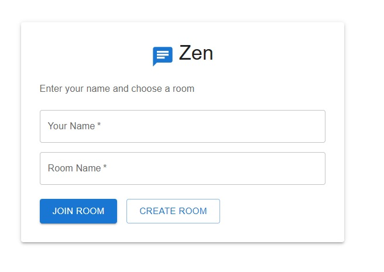
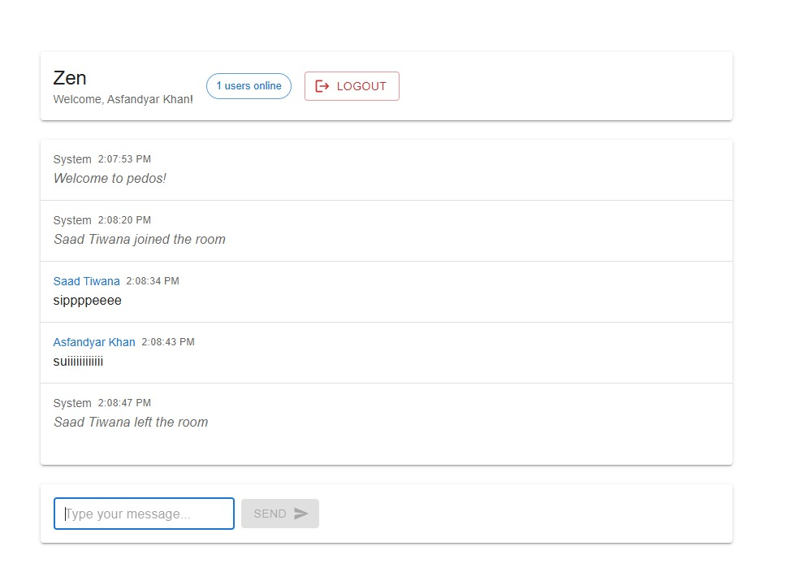

# ⚡ Zen 

> because sometimes you just gotta `npm i socket.io` and vibe 🧑‍💻

Real-time rooms  
Instant messages  
No database  
Just pure sockets  

---

**Example Session** — _Asfandyar Khan_ & _Saad Tiwana_ in room **pedos**  

## 📸 Screenshots

**Home Screen**  


**Chat Screen**  


---

## 🚀 Run it

**Backend**
```bash
cd backend
npm install
node server.js
````

**Frontend**

```bash
cd frontend
npm install
npm run dev

